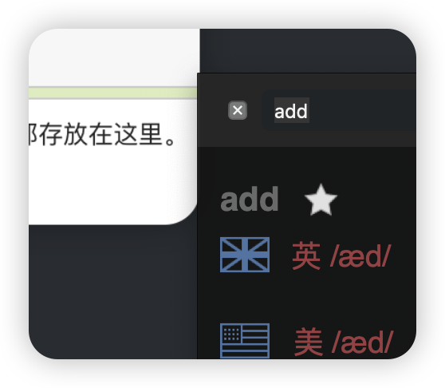

# Git and GitHub record

分布式版本控制工具 和 代码托管平台

`git init`

 

`git add  ./hello.txt`

添加文件到暂存区

`git commit -m "xxxx"`

添加暂存区文件到本地仓库，版本生成

`git status`

查看版本信息，各种信息

`git reset --hard {versionId}`

切换版本

- 在本地库移动指针
- 重置暂存区
- 重置工作区

`git branch`

查看分支列表，以及当前分支

`git branch {branchName}`

创建分支

`git branch -d (branchname)`

删除分支	

`git checkout {branchName}`

移动分支

`git merge {branchName}`

将branchName分支合并到现在所处的分支，如果当前分支也有新内容会无法自动合并，会把conflict标注进去文件，你需要自己vim进去进行选择性合并解决conflict

